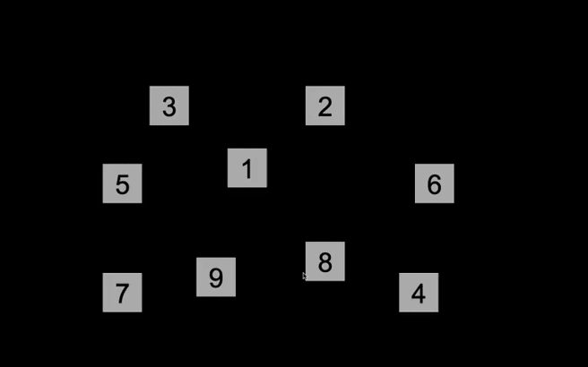

# Psychopy Spatial Working Memory Test

This is a [Psychopy](https://psychopy.org) project consisting of a spatial working memory task. 

In each trial of the experiment, the participant is shown a sequence of targets lighting up. The participant is then to click the targets in the same sequence that they lit up. The sequences increase in length from 2 to 9 targets, with 3 trials for each difficulty level. If the participant fails all trials of a difficulty level, the experiment ends straight away in order to prevent participant frustration.

Placement of targets is randomly generated in a way that prevents overlapping targets. 

## Modifying the experiment
Most experiment specifications, e. g. number of trials/difficulty level, min/max difficulty level, square size et c, are done in a code snippet linked to the first routine (in the PsychoPy Builder interface), meaning that you can easily change them. This includes whether randomly arranged numbers should appear on top of the targets. All instruction messages (in American English by default) are also defined in this code snippet, which simplifies translation.

If you don't want target 'light-up sequences', coordinates and numbering to be randomly generated, you can set the experiment to use the same configurations for every run. This is useful if you want each participant to go through exactly the same experiment. For instructions on how to do this, open up the scripts in the folder 'specifications_generation' with a text editor and read the documentation at the top of each file. 

## Translating the experiment
For instructions specifically about translating the experiment, read the 'translations_instructions.txt' document in the 'translations' directory.

## Experiment data output
For each trial the experiment saves participant response times (saving the time for each click), the correct sequence, what sequence the participant clicked the boxes in, and whether the participant's responses were correct or not. Note that target numbering, as used when saving sequences, has nothing to do with targets' positions or the numbers that randomly appear on targets (if you have enabled these). If you want detailed information about spatial patterns of participants' responses you should activate saving coordinates on every click for the trial's mouse component.